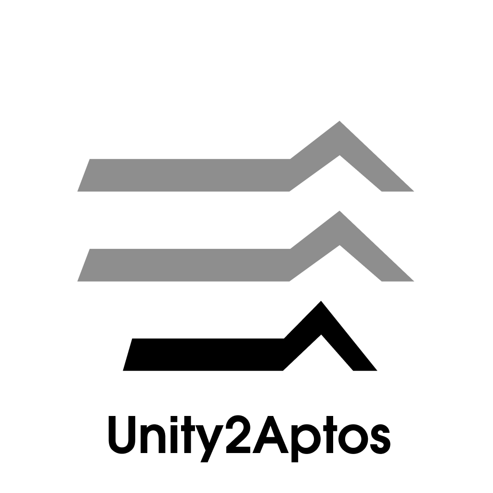

<p align="center">
	
</p>

# Unity2Aptos #

## 		Aptos Made Easy in Unity

[](https://github.com/MarcoDotIO/Aptos-Unity-SDK/actions/workflows/main.yaml) [](https://unity3d.com) [](https://discord.gg/aptoslabs)

Aptos2Unity is a Unity package written in C# to help developers integrate Aptos blockchain technology into their projects.

- [Features](#features)
- [ToDo](#todo)
- [Requirements](#requirements)
- [Dependencies](#dependencies)
- [Installation](#installation)
  - [Unity Package Importer](#unity-package-importer)
- [Using Unity2Aptos](#using-unity2aptos)
  - [RestClient](#restclient)
  - [FaucetClient](#faucetclient)
  - [TokenClient](#tokenclient)
  - [Account](#account)
  - [Wallet](#wallet)
- [Examples](#examples)
- [License](#license)

### Features ###

- [x] Generate new wallets.
- [x] Create new accounts using the ED25519 Key Standard.
- [x] Simulate and submit transaction.
- [x] Create new collections.
- [x] Create new tokens.
- [x] Check account information (Token and APT balances, submitted contracts, etc).
- [x] Import previously used wallets using BIP-39 and BIP-32 Mnemonic seeds or an ED25519 private key.
- [x] Create arbitrary tokens.
- [x] Compatibility with main, dev, and test networks.
- [x] Comprehensive Unit and Integration Test coverage.

### ToDo

- [ ] Implement full documentation.
- [ ] Implement E2E Testing.
- [ ] Implement full coverage of BCS transactions.

### Make Account Transfer Quickly and Easily! ###

With how easy the library is to use, Unity2Aptos gives you the power to quickly setup a Sui account and be able to transfer coins in only a few lines of code:
```c#
// Initialize Transaction.
Transaction transferTxn = new Transaction();

// Start Coroutine with the transaction.
Coroutine transferCor = StartCoroutine(RestClient.Instance.Transfer((_transaction, _responseInfo) =>
{
	transferTxn = _transaction;
	responseInfo = _responseInfo;
}, alice, bob.AccountAddress.ToString(), 1000));

// Yield return the coroutine.
yield return transferCor;
```

### Requirements ###

| Platforms                              | Unity Version | Installation           | Status       |
| -------------------------------------- | ------------- | ---------------------- | ------------ |
| Windows /  Mac / iOS / Android / WebGL | 2021.3.x      | Unity Package Importer | Fully Tested |
| Windows /  Mac / iOS / Android / WebGL | 2022.2.x      | Unity Package Importer | Fully Tested |

### Dependencies
- [Chaos.NaCl.Standard](https://www.nuget.org/packages/Chaos.NaCl.Standard/)
- Microsoft.Extensions.Logging.Abstractions.1.0.0 — required by NBitcoin.7.0.22
- Newtonsoft.Json
- NBitcoin.7.0.22
- [Portable.BouncyCastle](https://www.nuget.org/packages/Portable.BouncyCastle)

### Installation ###

#### Unity Package Importer ####

- Download the latest `aptos-unity-sdk-xx.unitypackage` file from [Release](https://github.com/aptos-labs/Aptos-Unity-SDK/releases)
- Inside Unity, Click on `Assets` → `Import Packages` → `Custom Package.` and select the downloaded file.

​	**NOTE:**  As of Unity 2021.x.x, Newtonsoft Json is a common dependency. Prior versions of Unity require installing Newtonsoft.

### Using Unity2Aptos ###

Unity2Aptos is designed to be very easy to integrate into your own Unity projects. The main functionality comes from several key classes: `RestClient`, `FacetClient`, `TokenClient`, `Account`, and `Wallet`. Let's go over each of the classes, along with examples for each to demonstrate their power and flexibility.

#### RestClient ####

The REST Client provides you with the fundamental transaction endpoints needed for interacting with the Aptos Blockchain. As shown before, it only take a few lines of code to initialize a transfer for Aptos coins. Here's another example showing how to create a collection:
```c#
// Collection Details.
string collectionName = "Alice's";
string collectionDescription = "Alice's simple collection";
string collectionUri = "https://aptos.dev";

// Initialize Collection.
Transaction createCollectionTxn = new Transaction();
Coroutine createCollectionCor = StartCoroutine(RestClient.Instance.CreateCollection((_createCollectionTxn, _responseInfo) =>
{
	createCollectionTxn = _createCollectionTxn;
	responseInfo = _responseInfo;
}, alice, collectionName, collectionDescription, collectionUri));
yield return createCollectionCor;
```

Here's also how to wait for a transaction:

```c#
// Initialize Transaction.
Transaction transferTxn = new Transaction();
Coroutine transferCor = StartCoroutine(RestClient.Instance.Transfer((_transaction, _responseInfo) =>
{
	transferTxn = _transaction;
	responseInfo = _responseInfo;
}, alice, bob.AccountAddress.ToString(), 1000));

yield return transferCor;

if (responseInfo.status != ResponseInfo.Status.Success)
{
	Debug.LogWarning("Transfer failed: " + responseInfo.message);
	yield break;
}

// Wait For Transaction.
bool waitForTxnSuccess = false;
Coroutine waitForTransactionCor = StartCoroutine(RestClient.Instance.WaitForTransaction((_pending, _responseInfo) =>
{
	waitForTxnSuccess = _pending;
	responseInfo = _responseInfo;
}, transactionHash));
yield return waitForTransactionCor;

if (!waitForTxnSuccess)
{
	Debug.LogWarning("Transaction was not found. Breaking out of example", gameObject);
	yield break;
}
```

#### FaucetClient ####

The Faucet Client allows the developer to leverage the ability to fund wallets on any of the non-main networks within the Aptos Blockchain. This can easily speed up development times through automating the process of funding wallets. Here's an example on how to use the Faucet Client:

```c#
// Initialize Funding Request.
Coroutine fundAliceAccountCor = StartCoroutine(FaucetClient.Instance.FundAccount((_success, _responseInfo) =>
{
	success = _success;
	responseInfo = _responseInfo;
}, aliceAddress.ToString(), 100000000, faucetEndpoint));
yield return fundAliceAccountCor;
```

#### TokenClient ####

The Token Client provides the ability for the developer to have an easier time implementing NFT mechanics into their projects. Here's an example on minting an NFT using the client:

```c#
// Token Details.
string collectionName = "Alice's";
string tokenName = "Alice's first token";

// Initialize Token Mint.
Coroutine mintTokenCor = StartCoroutine(tokenClient.MintToken((_mintTokenTxn, _responseInfo) =>
{
	mintTokenTxn = _mintTokenTxn;
	responseInfo = _responseInfo;
},
	alice,
	collectionName,
	"Alice's simple token",
	tokenName,
	"https://aptos.dev/img/nyan.jpeg",
	new PropertyMap(new List<Property> { Property.StringProp("string", "string value") })
));
yield return mintTokenCor;
```

#### Account ####

Accounts within the SDK represent the core part of a Wallet, that give ease of access to the needed information you'd need for communicating with the Aptos Blockchain. Here are some example initializations of accounts:

```c#
// Generate Random Account.
Account alice = Account.Generate();

// Initialize Account Using Hexadecimal Private Key.
const string PrivateKeyHex = "0x64f57603b58af16907c18a866123286e1cbce89790613558dc1775abb3fc5c8c";
Account bob = Account.LoadKey(PrivateKeyHex);

// Initialize Account Using Private and Public Key Bytes.
private static readonly byte[] PrivateKeyBytes = {
	100, 245, 118, 3, 181, 138, 241, 105,
	7, 193, 138, 134, 97, 35, 40, 110,
	28, 188, 232, 151, 144, 97, 53, 88,
	220, 23, 117, 171, 179, 252, 92, 140
};
private static readonly byte[] PublicKeyBytes = {
	88, 110, 60, 141, 68, 125, 118, 121,
	34, 46, 19, 144, 51, 227, 130, 2,
	53, 227, 61, 165, 9, 30, 155, 11,
	184, 241, 161, 18, 207, 12, 143, 245
};
Account chad = new Account(PrivateKeyBytes, PublicKeyBytes);
```

#### Wallet ####

Wallets will be the primary method of accessing accounts on the Aptos Blockchain via Mnemonic Keys, since they'll allow you to generate multiple accounts with ease. Here's an example on how to initialize a wallet using a mnemonic key:

```c#
// Initializing Wallet.
string mnemo = "stadium valid laundry unknown tuition train december camera fiber vault sniff ripple";
Wallet wallet = new Wallet(mnemo);
```

### Examples ###

The SDK comes with several examples and a demo project that show how to leverage the SDK to its full potential. The examples include `AptosToken`, `Multisig`, `SimulateTransferCoin`, `TransferCoin`, and `SimpleNftExample`. As well, the demo project, shown below, is an example project that gives you various options to test out.


### License ###

Unity2Aptos is released under the Apache 2.0 license. [See LICENSE](https://github.com/MarcoDotIO/Aptos-Unity-SDK/blob/main/LICENSE) for details.
